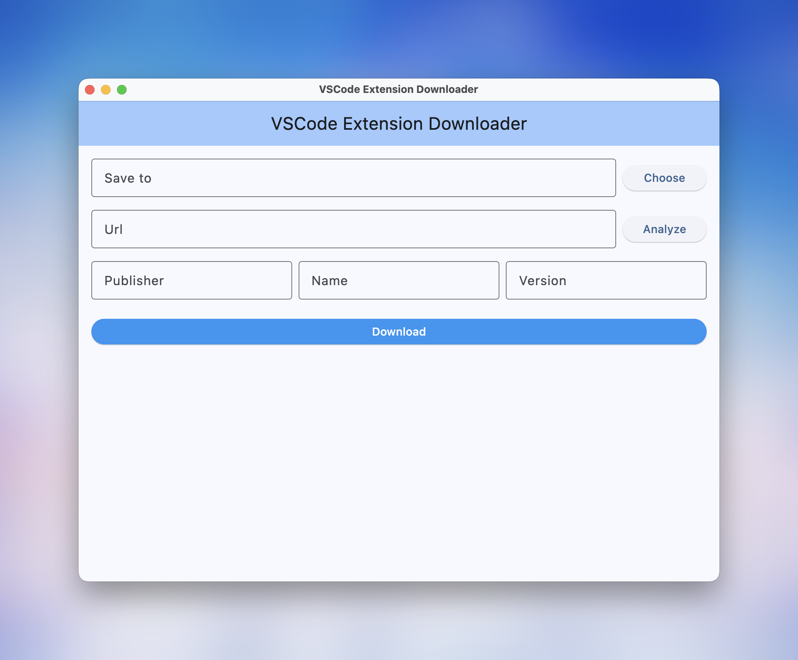

# vscode_extension_downloader

A really simple application which can help you download extension from [Visual Studio Marketplace](https://marketplace.visualstudio.com/)

## Motivation

Because download button of extensions on [Visual Studio Marketplace](https://marketplace.visualstudio.com/) is disappear, so I decide to make this application for easily downloading extensions from Visual Studio Marketplace;

## Screenshot

## Usage
1. Choose where you want to save downloaded extension
2. Fill in informations about the extension you want to download

3. Click `Download` button to download it.

## Contribution
Welcome to contribute to this project. Feel free to open an issue or submit a pull request.
